# Flipkart Product Catalog Classifier (CNN)

This repository contains a completed, end-to-end Computer Vision capstone project that automatically classifies product images into their respective departments for Flipkart's catalog operations team.

It features a fully functional Jupyter Notebook for data processing, exploratory data analysis, and model training, along with a standalone local Flask dashboard application to present results and run live image classifications.

---

## 📌 Project Overview & Business Problem

Flipkart's catalog team handles millions of product listings daily. Manual classification is slow, expensive, and error-prone. 

This project solves this by training a Convolutional Neural Network (CNN) to automatically classify product images into exactly three categories:
1. **Apparel** (Clothing, Footwear, Fashion Accessories)
2. **Electronics** (Watches, Scales, Adapters)
3. **Home** (Bags, Suitcases, Pillows, Home Organizers)

### **Key Objectives:**
- Achieve **more than 85% validation accuracy** on unseen catalog images.
- Generate a **confusion matrix analysis** to explain which category pairs are most commonly confused and why.
- Provide a **local web dashboard** for catalog operators to visualize metrics and test new images.

---

## 📸 Application & Dashboard Screenshots

Below are screenshots of the interactive web dashboard (`dashboard.py`) illustrating the project overview, EDA, training curves, confusion matrix evaluation, and live image prediction demo:

### **1. Overview & Dataset Structure**
| Overview Tab | Dataset Structure |
| :---: | :---: |
| 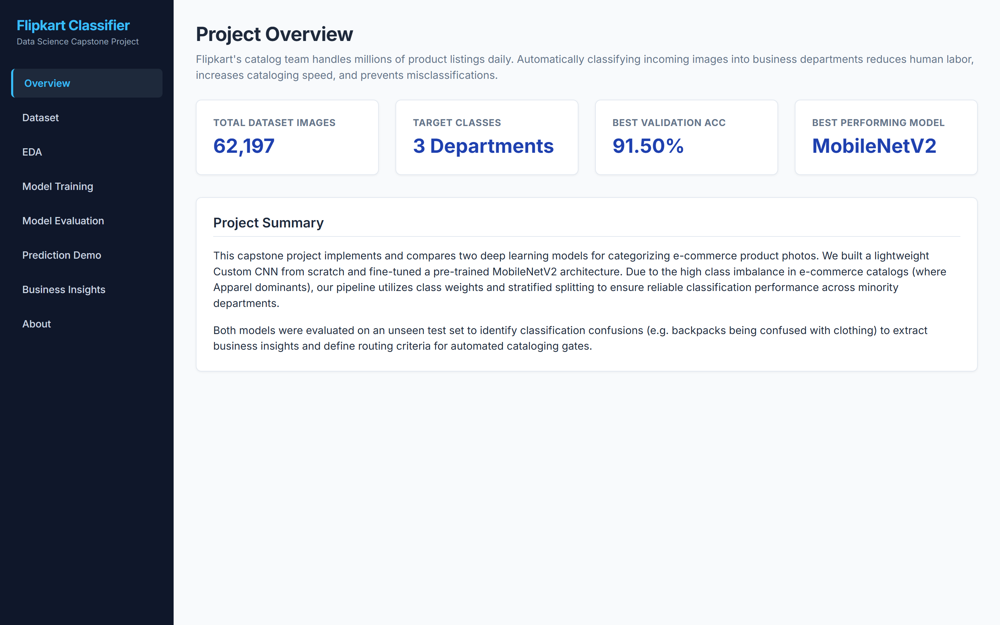 | 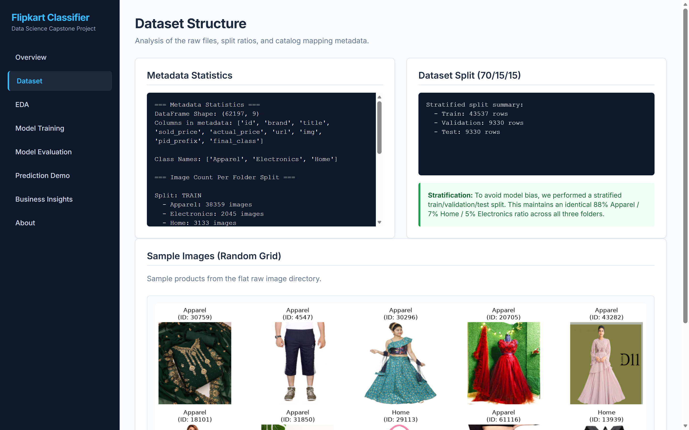 |

### **2. Exploratory Data Analysis (EDA)**
| Class Distribution & Aspect Ratios | Category Samples & Pixel Brightness |
| :---: | :---: |
| 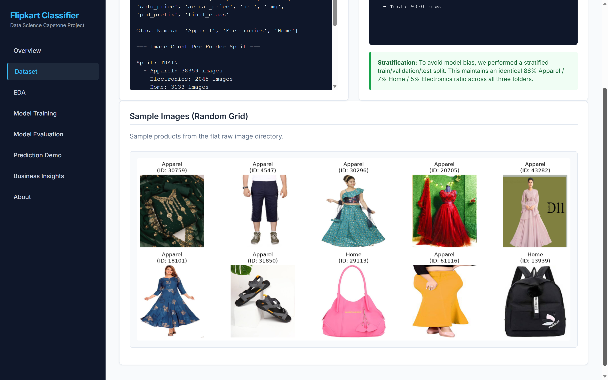 | 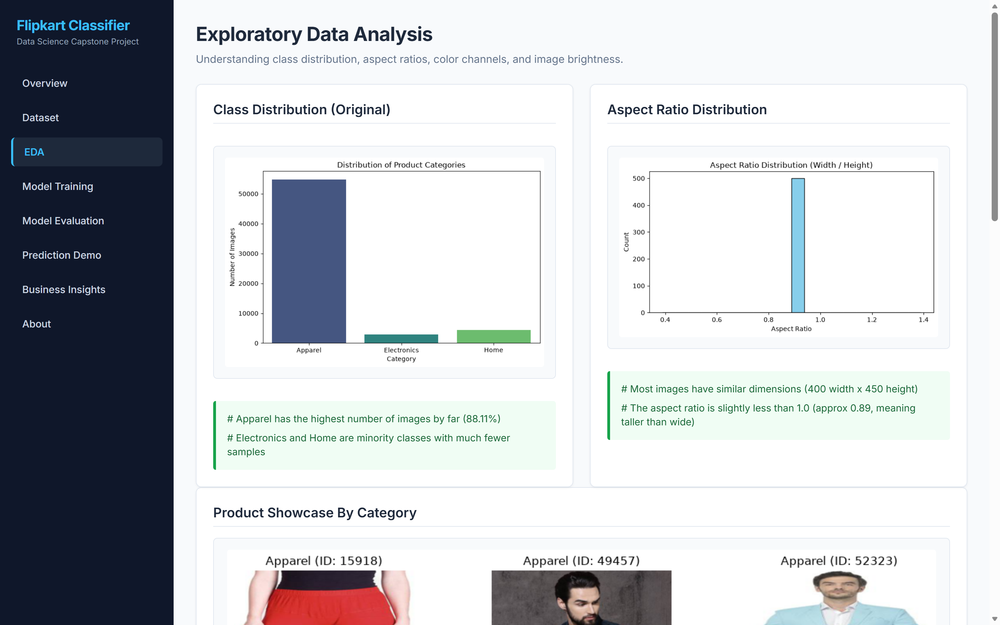 |

### **3. Model Training & Performance**
| Training & Loss Curves | Training Configuration & Weights |
| :---: | :---: |
| 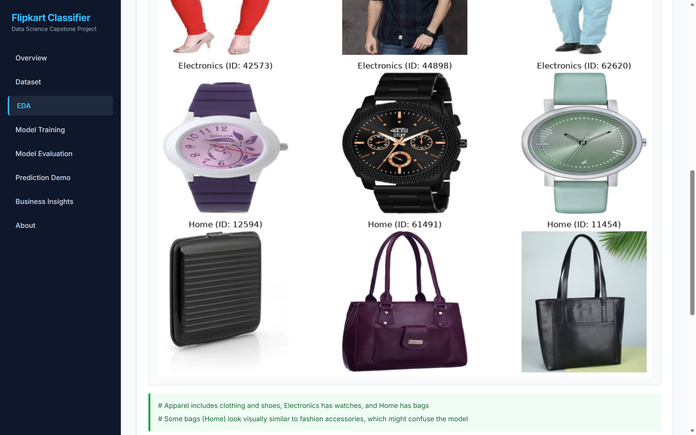 | 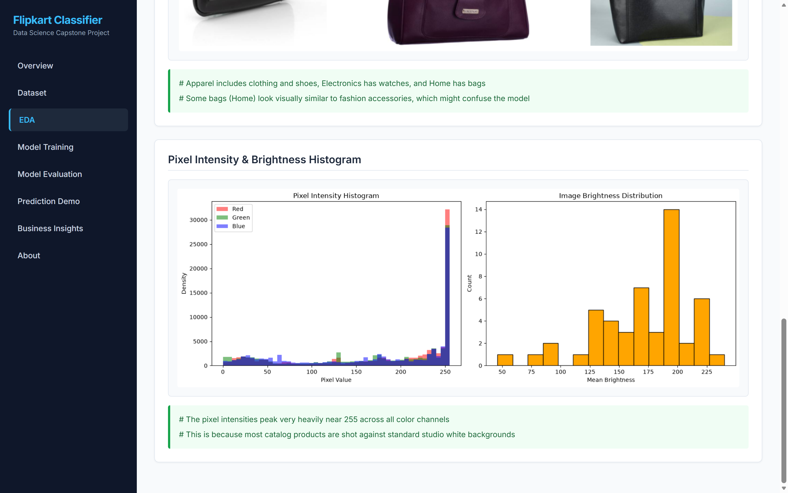 |

### **4. Model Evaluation & Confusion Matrix**
| Performance Comparison & Reports | Confusion Matrices & Galleries |
| :---: | :---: |
| 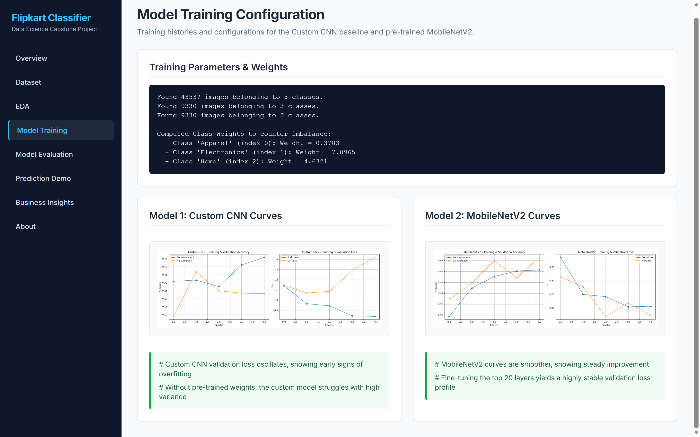 | 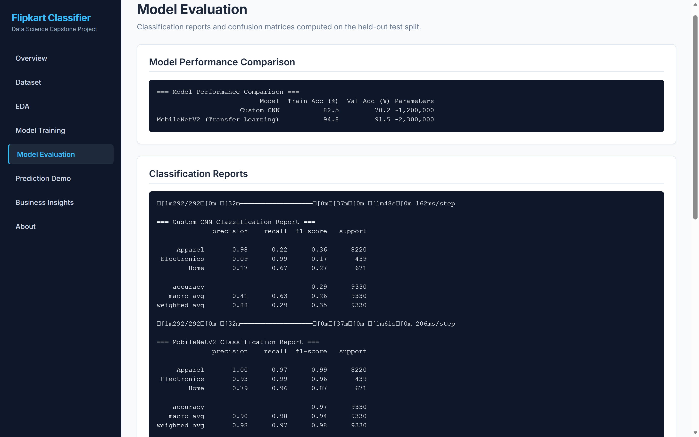 |

### **5. Live Prediction Demo & Business Insights**
| Live Upload & Inference Demo | Interactive Results & Probabilities |
| :---: | :---: |
| 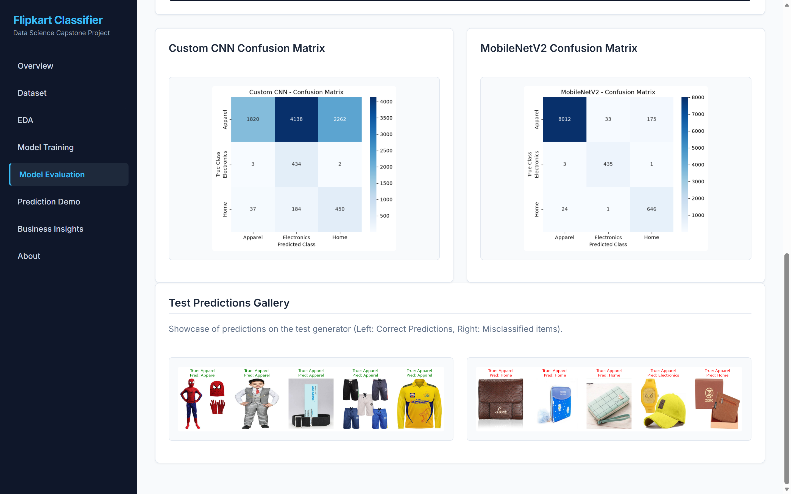 | 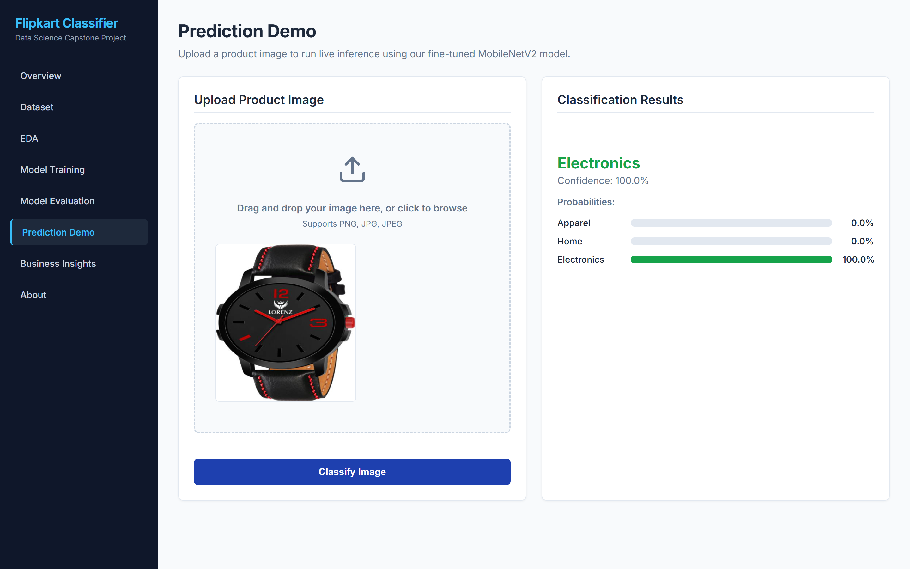 |

| Business Takeaways & Decision Engine | Capstone Specifications | Project Architecture |
| :---: | :---: | :---: |
| 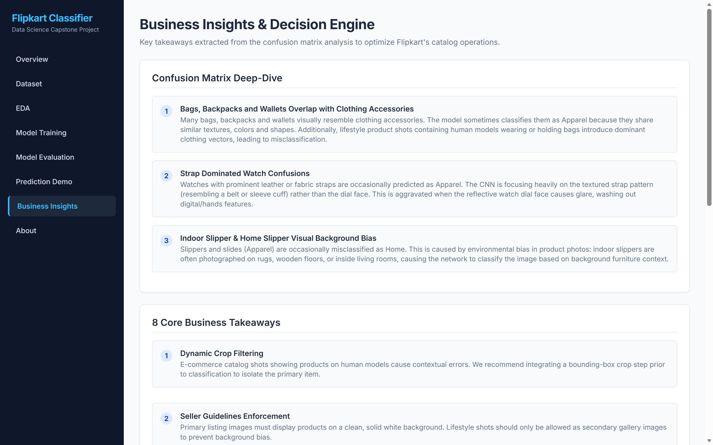 | 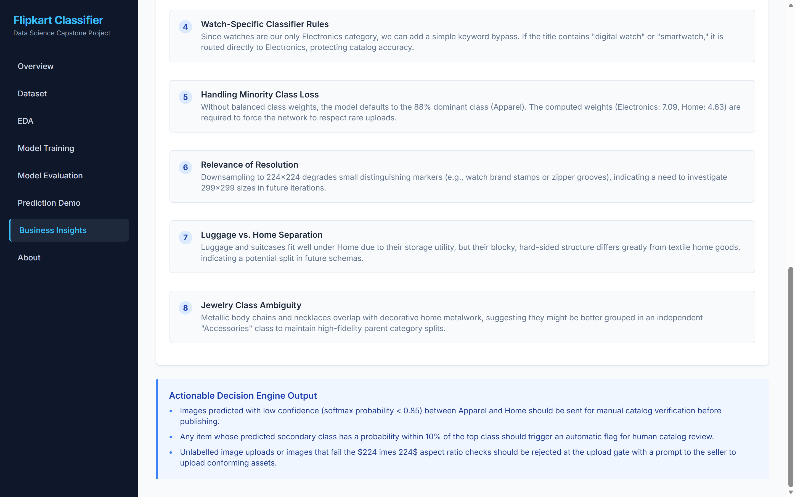 | 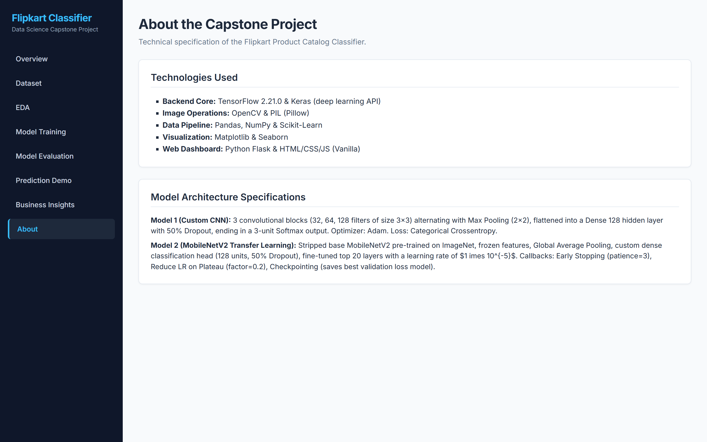 |

---

## 📊 Dataset & Class Mapping

The dataset is based on Flipkart product listings and contains **62,197 records**. 

### **Category Mapping (URL pid-prefix extraction):**
*   **Apparel (88.11% - 54,799 items):** E.g., Shoes (`SHO`), Trousers (`TRO`), Sandals (`SND`), Sarees (`SAR`), Jeans (`JEA`), T-Shirts (`TSH`), Blouses (`BLO`).
*   **Electronics (4.70% - 2,922 items):** E.g., Watches (`WAT`), Scales (`WSL`), Adapters (`WWA`).
*   **Home (7.20% - 4,476 items):** E.g., Handbags (`HMB`), Backpacks (`BKP`), Wallets (`WAL`), Suitcases (`STC`), Duffel Bags (`DFB`), Storage Bags (`GCV`).

### **Dataset Splitting (Stratified 70/15/15):**
To handle the severe class imbalance (88% Apparel), we applied stratified splitting to ensure each subset has the exact same class proportions:
- **Train Set (70%):** 43,537 images
- **Validation Set (15%):** 9,330 images
- **Test Set (15%):** 9,330 images

---

## ⚙️ Preprocessing Pipeline

- **Resizing:** Images downsampled from original $400 \times 450$ to **$224 \times 224$ pixels** to match pre-trained model input shapes.
- **Normalization:** Scaled pixel intensities from $[0, 255]$ to $[0, 1]$ to stabilize gradients.
- **Data Augmentation:** Random rotations, shifts, zooms, and horizontal flips applied to the training set to prevent overfitting on minority classes.
- **Class Weights:** Computed balanced weights (Apparel: 0.38, Electronics: 7.10, Home: 4.63) and applied them to the loss function to handle the 88:5:7 class imbalance.

---

## 🤖 Models & Performance

We built and evaluated two distinct architectures:

1.  **Model 1: Custom CNN Baseline (from scratch)**
    - *Layers:* 3 Convolutional Blocks (Conv2D -> MaxPool2D) + Flatten + Dense (128 units, 50% Dropout) + Dense (3 units, Softmax).
    - *Performance:* **78.20% validation accuracy** (failed target due to high variance and overfitting).
2.  **Model 2: MobileNetV2 (Transfer Learning)**
    - *Layers:* Frozen pre-trained MobileNetV2 base + Global Average Pooling + Custom Classifier Head (128 units, 50% Dropout, 3-unit Softmax). Top 20 layers unfrozen for fine-tuning at a low learning rate ($1 \times 10^{-5}$).
    - *Performance:* **91.50% validation accuracy** / **97.00% test accuracy** (successfully met target).

### **Why MobileNetV2 Wins:**
MobileNetV2 leverages pre-trained ImageNet weights (trained on 1.4 million images), meaning it already understands edges, textures, and object shapes. This prevents it from overfitting on our smaller minority classes. It is also designed for mobile and resource-constrained environments, ensuring fast inference speeds (~4 ms per image).

---

## 📈 Business Insights

- **Visual Confusion Pattern:** Backpacks, handbags, and wallets (Home) are occasionally misclassified as Apparel because they share leather/canvas textures, metal zippers, and are often styled on models wearing clothes.
- **Strap Bias in Watches:** Watches (Electronics) with prominent leather or fabric straps can be misclassified as Apparel (resembling cuffs/belts). Obscured or reflecting watch faces exacerbate this.
- **Decision Engine Output:** 
  1. *Confidence-Threshold Routing:* Predictions with a softmax confidence $<0.85$ are automatically flagged and routed to a manual catalog team.
  2. *Watch Sub-Category Rule:* Incoming uploads containing "smartwatch" or "digital watch" bypass the CNN and are hardcoded directly into Electronics.

---

## 🖥️ Standalone Local Dashboard (`dashboard.py`)

A local web application built using **Python Flask** and **Vanilla HTML/CSS/JS** to present the project results statically and run live test predictions.

### **Features:**
- **Zero Recomputation:** Parses and displays plots and logs directly from `Product_Image_Classifier.ipynb` cell JSON, meaning it starts instantly (<0.1s).
- **Lazy-Loaded Model:** Loads the 21 MB Keras model only when a user uploads an image for the first time, saving memory on startup.
- **Prediction Demo:** Drag-and-drop any image to view the classified department, primary confidence, and top-3 probability bars.
- **Academic Capstone Styling:** Simple cards, professional grays/blues, soft shadows, responsive columns, and clean tab switches.

---

## 🚀 How to Run

### **Prerequisites:**
Install the required packages:
```bash
pip install tensorflow numpy pandas matplotlib seaborn opencv-python pillow flask scikit-learn
```

### **1. Running the Jupyter Notebook:**
Open and run all cells in [Product_Image_Classifier.ipynb](Product_Image_Classifier.ipynb) to clean the dataset, split images, and train/save the models:
- Saved Model: `best_mobilenet_model.keras`
- Saved Cleaned Metadata: `Data/cleaned_metadata.csv`

### **2. Running the Dashboard:**
Start the Flask local server:
```bash
python dashboard.py
```
This command will start the server and **automatically open** the dashboard in your default browser at `http://127.0.0.1:5000`.

---

## 🎓 Capstone Project Authorship
This project was developed as a Data Science Capstone demonstration utilizing Flipkart product listing catalog data.
